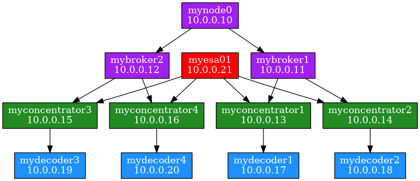

# nw_aggr_map

Produces an aggregation map of a Netwitness environment in a text-based data file, for use with automated graph-generation tools (such as [GraphViz](https://en.wikipedia.org/wiki/Graphviz)).  With this tool, you can produce a usable environment map in just minutes!

> NOTE: This project is hosted in GitLab.  You can find it [here](https://gitlab.com/mitchellhanksRSA/nw_aggr_map)

## Basic Usage

### Run the script to get the mapping data

This will display the output to screen.

``` sh
nw_aggr_map.py
```

To dump to a file just pipe the output

``` sh
nw_aggr_map.py > sample_nw_map.gv
```

### Produce a graph from the mapping data

The GraphViz toolset is open source and there is a good Python command-line interface available called [PyDot](https://pypi.org/project/pydot/), which is shown below.  If you have trouble getting it installed via pip, you can try your official Linux repo as described in [this post](https://askubuntu.com/questions/917030/how-to-install-pydot-and-graphviz).

Once you have PyDot installed, simply run it against your data file to produce an image file (in this case a png).

``` sh
dot -Tpng -o sample_nw_map.png sample_nw_map.gv
```

This will produce a graphic similar to this:



